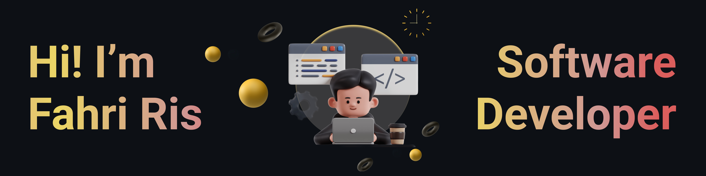

# 💫 About Me:
Hello there! 👋  
I'm Fahri Ris, a passionate **Software Developer** with a love for building scalable and efficient systems. For most of my career, I’ve been focused on the **Backend** (which I believe is the heartbeat of every application) – making sure everything works seamlessly behind the scenes. While I’ve dabbled with **Frontend** technologies like React, my heart truly lies in the backend.
 
<!-- 🌱 **What I Do** 
I specialize in creating **robust, performant APIs**. Whether it's designing a database schema in **MySQL** or building **RESTful services** with **Spring Boot**, I love turning complex problems into simple, maintainable solutions.
   -->
I believe that great backend development is invisible – when it’s done right, users never see it, but they feel its efficiency and reliability.

<!-- ## 🌐 Let's Connect: -->

 
 
 
 

# 💻 Tech Stack:
                  
# 📊 GitHub Stats:
 
<!--   -->

<!-- ---
 -->

  <!-- ## 💰 You can help me by Donating
    -->

  
<!-- Proudly created with GPRM ( https://gprm.itsvg.in ) -->
